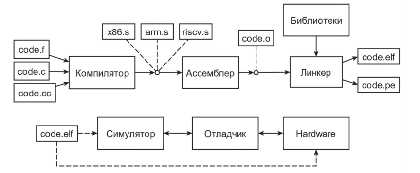
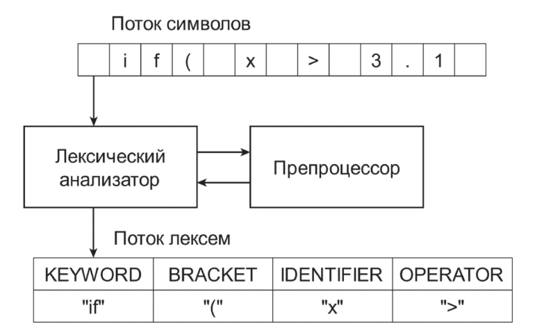
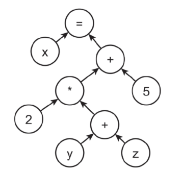
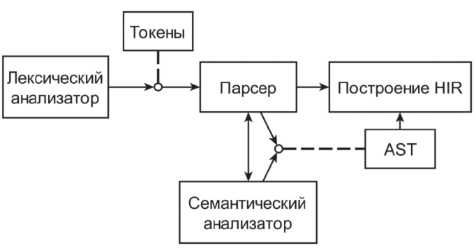
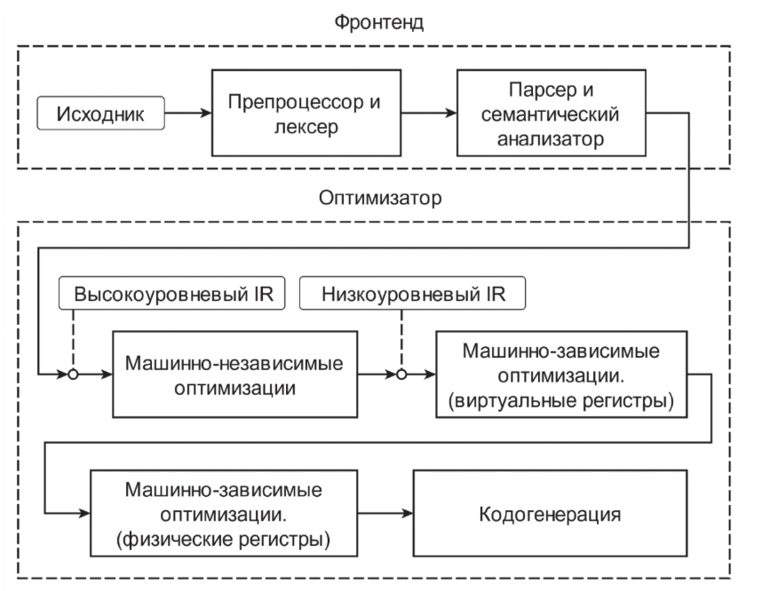
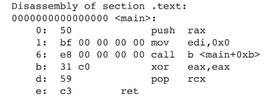
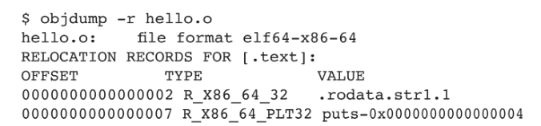

Современные программы компиляции (gcc, clang, cl) - на самом деле драйверы компиляции.
Запускающая из под себя Тулчейн (ру. Система компиляции).
Сам компилятор - часть тулчейна, состоящая из множества компонентов
(ассемблер, линкер, отладчик, профилировщик).

# Компиляторы

Конструктивно компилятор состоит из фронтенда (compiler fronted) (построение промежуточного представления) и бэкенда (compiler backend) (оптимизация и кодогенерация).

## Лексический анализ

Первая фаза фронтенда - лексический анализ и препроцессинг (Лексический анализатор и Препроцессор).

Ключ. пон. - *лексема или токен*. Токен - атомарная ед. анализа. (слово, зап. или числ.). Обычно хранят в виде тип - значение.

## Синтаксический анализ

(Парсер или Синтаксический анализатор). Цель - построение Abstract syntax tree (AST). Этот процесс называют синтаксическим разбором или парсингом.

Синтаксическое дерево - представление программы, связ. операции с зависимостями по данным. При этом подвыражения являются вершинами этого дерева, дочерними относительно выражений, которые из них состоят.

Пример x = 2 * (y + z) + 5

Синт. анализатор работает в паре с семантическим анализатором для построения AST.

Синтаксический анализатор при построении вершины AST, следующей из грамматики, обращается к семантическому анализатору за проверкой семантики порождаемой конструкции.

## Промежуточное представление

В книге два уроня IR:

1. High-Level IR, HIR - удобно для машинно-независимых оптимизаций. Много метаинформации, от конкретного ЯП (gcc Gimle, llvm IR).
2. Low-Level IR, LIR - удобно для машинно-зависимых оптимизаций. Близок к конструкциям конкретной машины, для которой происходит кодогенерация (gcc RTL, llvm MachineIR).

## Машинно-независимые оптимизации

Каждая оптимизация представляет собох проход (пасс). Во время очередного прохода компилятор будет рассматривать контекст всего модуля, функии или отдельных ее частей (отдельный цикл).

## Кодогенерация

Процесс выбора и планирования инструкций, распределения регистров и генерации ассемблерного кода.

Для начала происходит перевод HIR в LIR для машинно-зависимых оптимизаций (называется instruction selection).

## Ассемблеры

Программа, транслирующая программу на языке ассемблера в объектный код. Объектным кодом называется специальной представление, машинного кода, в котором интсрукции уже закодированны, но который еще не предназначен для исполнения, а для дальнейшей линковки.

### Релокации

Внешний вызов ассемблер оставляет как дисплейсмент.

И заносит информацию о том, что это внешний вызов в секцию релокации

Тут релокации - это информация, которая сообщает компоновщику (линкеру), какие адреса в объектном файле (`.o`) ещё не известны и должны быть скорректированы (разрешены) во время компоновки или загрузки программы.

## Линкеры

Линкует объектные файлы.

### Оптимизации времени линковки (LTO)

Вместо честных объектных файлов, ассемблер аннотирует их исходным кодом и далее использует плагин линкера, который на этапе линковки снова вызывает компилятор на псевдообъектники и далее использует плгагин линкера, который на этапе линковки сновка вызывает компилятор на эти псевдо-объектники и во время линковки еще раз оптимизирует их.

`gcc -O2 -flto part.c main.c`
