# Введение в оптимизации

## Поток управления

*Поток управления* - состоит из базовых блоков и связей между ними.

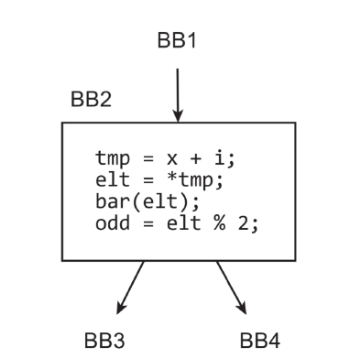

*Базовым блоком* называют последовательность инструкций HIR, в которую управление может войти только в начале последовательности и выйти только в конце, не счиная вызова функций. Эта последовательность завершается одной или несколькими инструкциями перехода на другие базовые блоки. Один вход и сколько угодно выходов.

Все базовые блоки вместе со специальными начальным bb entry и конечным bb exit являются вершинами графа управления функции (control flow graph, CFG). Ориентированными ребрами этого графа являются переходы между bb.

## Решетки и распростронение констант

### Бинарные отношения

*Бинарные отношения (binary relation)* ассоцирует элемент своей области определения с элементом своей области значений и является просто каким-то множеством пар этих элементов.

x соотносится с y как R (пишестя xRy), если пара (x, y) принадлежит бинарному отношению R. Далее только гомогенное бинарное отношение.

Прим.: если область опр. - натуральные числа и R - "меншье", то R будет множеством пар (1, 4), (2, 3) и т.д.

Гомогенные бинарные отношения имеют много общего с направленными графами.

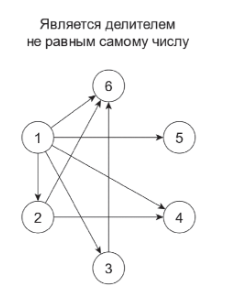

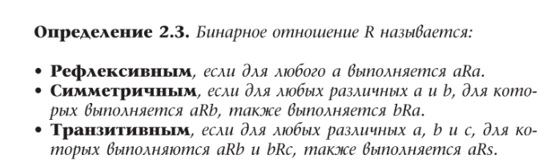

### Решетки

Представим, что некое отношение является рефлексивным, a <= b антисимметричным и транзитивным, например отношение таково для любых натуральных a и b. Такими отношениями называются оношения *частичного порядка*. Множество, на котором определено такое отношения, называют частично упорядоченным множеством частичного порядка (partial ordered set, poset).

Частично упорядоченное множество называется решеткой (lattice), если на нем можно ввести операции пересечения (meet) a ∩ b и объединения (join) a U b, таким образом что:

1. Их результаты тоже принадлежат тому же частично упорядоченному множеству. 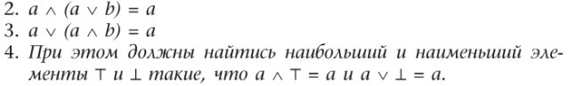

a join b ближайший элемент, которому предшествуют a b, a meet b ближайший элемент, который предшествует a b.

*Продвижение констант - замена переменных, значение которых известно на этапе компиляции, на их значения.

Решетка продвижения констант: T - overdefined, ⊥ - undefined элемент. join - операция схождения управления.

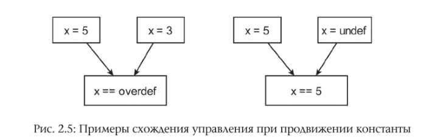

Если по разным дугам константа определенна с разными значениями - мы не можем делать вывод о значении переменной.

## Продвижение констант

Проход с трансформацией

*Передаточной функцией базового блока называется функция, определяющая изолированное действие этого блока на вектор переменных.*

Пример:

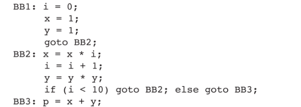

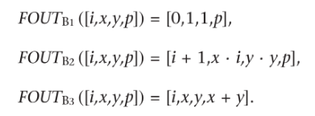

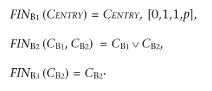

*Итеративный алгоритм продвижения констант*: начиная с какого-то вектора состояний программы, можно исполнять передаточные функции блоков и схождения управления и раз за разом уточнять множества FIN и FOUT.

*Неподвижной точкой для функции F на решетке является такая точка x, что F(x) = x*

*Алгоритм Гэри Килдала*:

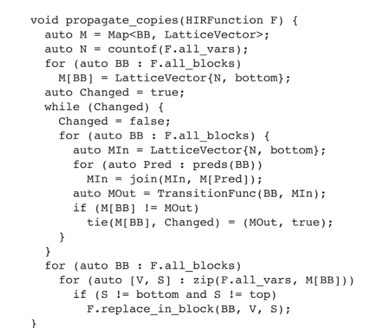

## Поток данных

Анализ данных, с которыми работает программа сводится к идее:

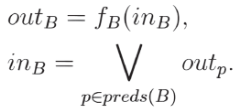

Доказано, что алгоритм, выч. неподвижную т., сходится к некому решению, но не всегда идеальному.

Ульман и Кам попытались свести задачу к MOP (meet over all path) решению. Такое решение возможно только для дистрибутивных задач ( f(a join b) = f(a) join f(b) ). Для других задач оно алгоритмически невычислимо.

## Reaching (Достигающие) defenitions

Аналитический проход

Задача узнать все определение переменных, потенциально достигающие базового блока.

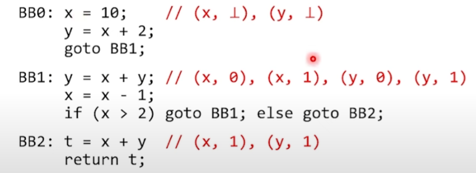Решение через битовые вектора

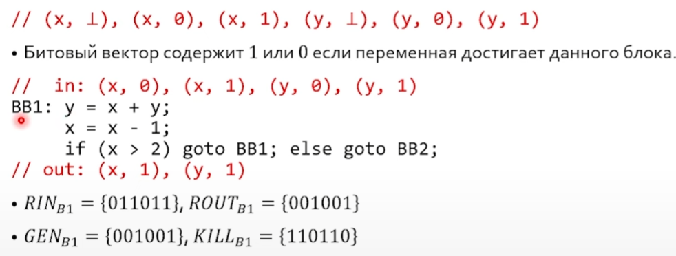

Уровнение reachin defenitions:

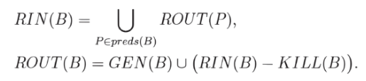

Алгоритм RD (по типу Килдала):

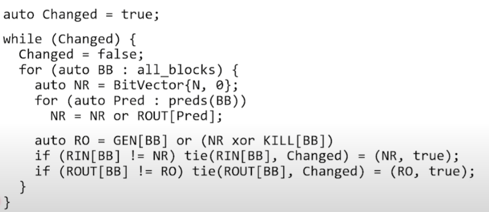

## Available expression

Аналитический проход

Доступным называется выражение, которое уже было предвычислено по всем путям, ведующим от entry к этобу BB.

Пример:

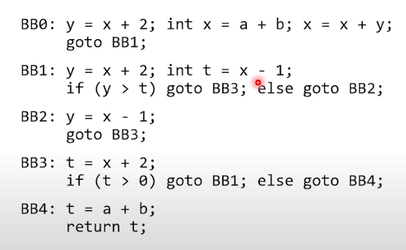

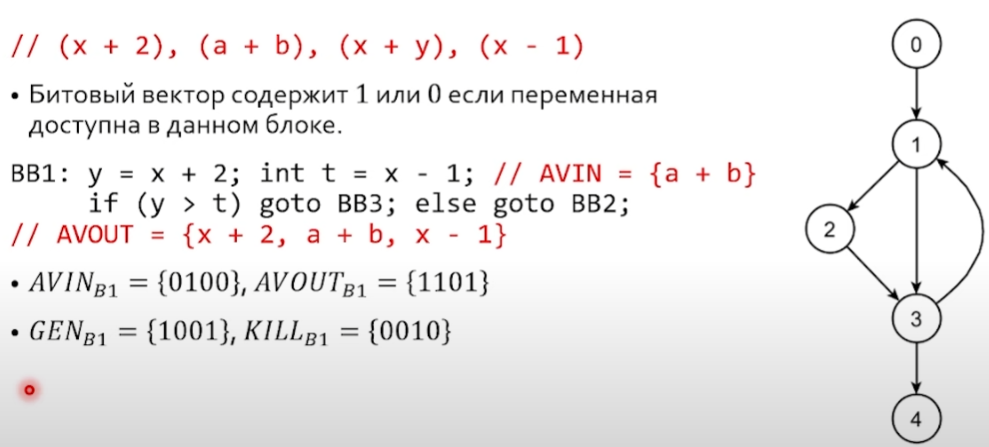

Решение проблемы:

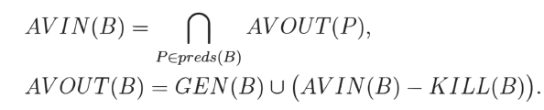

## Неформальный фреймворк

• Мы должны определиться с несколькими пунктами, после чего алгоритм
анализа потока данных получается, как бы сам собой.

• Множество интересующих нас сущностей. Например, множество доступных
выражений или множество доступных определений.

• Множества GEN и KlLL.

• Передаточные функции.

• Функция схождения управления. Это, как мы видели выше, может быть, обычная конъюнкция или дизъюнкция над булевыми векторами.

• Начальные условия.

• Направление анализа потока данных.

## (Активная) Live variables

Аналитический проход

*Активной переменной в блоке B называется переменная, которая хотя бы один раз используется на пути от блока B до exit-блока.*

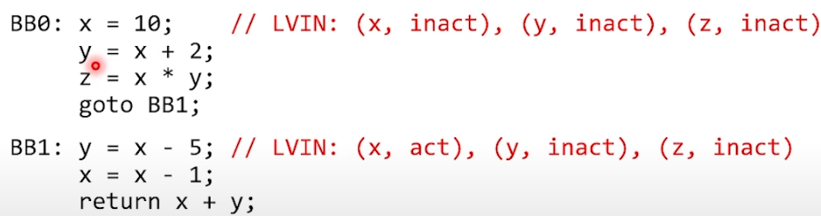

Формула:

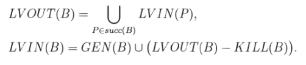

## Трансформация и анализ в HIR

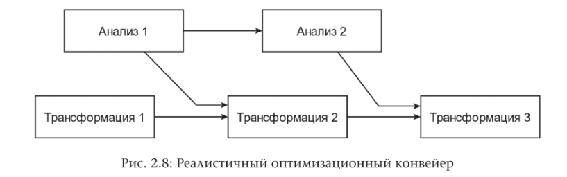В

## Нумерация значений

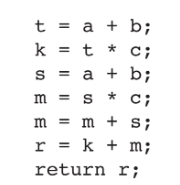

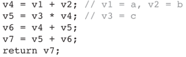

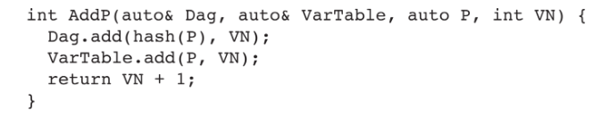

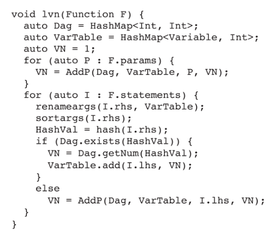
