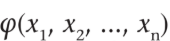
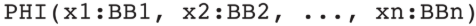
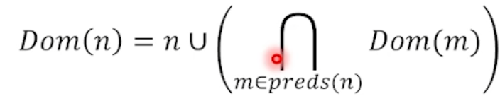
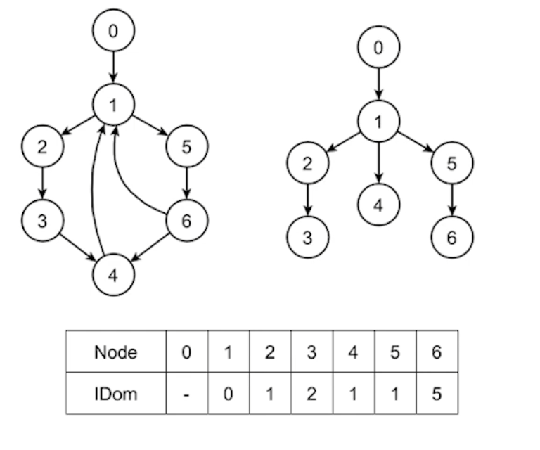
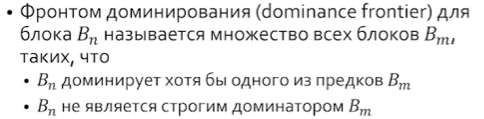
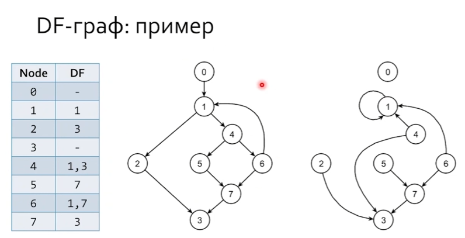
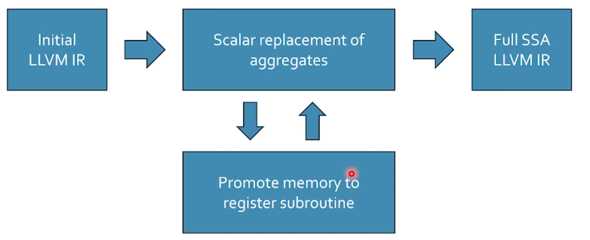

`https://www.youtube.com/watch?v=diSnBssZ1dQ&list=PL3BR09unfgcjBG1H9xRUesaQX6nCsobs1&index=6`

# Построение SSA

SSA (static single assignment) - форма, в которой перемен. присв. знач. один раз

Представление кода в SSA - это представление кода, в котором у каждой переменной есть единственное определение, сопровождающееся инициализацией.

 (фи-узел) задает схождение управление от переменных x..., опред. в разных б.б. в впрограмме мы пишем .

Правила фи-узлов:

1. все фи-узлы размещаются исключительно в начале бб
2. все фи-определения обрабатываются одновременно

# Доминирование

* Bi дом. Bj, если и только если Bi находится на всех путях от entry до Bj. Bj для себя является доменантом.



* Вершина Bi *строго* доменирует Bj, если она доминирует Bj и не совпадает с ним.
* Непосредстваенный доминатор - является ближайшим строгим доминатором по всем путям от entry. У каждой вершины только один непосредственный доминатор.

# Деревья доминаторов

Ребро - непоср. дом



# Фронт доминирования



В блоки входящие во фронт доминирования нужно вставлять фи-узлы.

DF-граф



# Построение SSA

Свойства:

1. Свойство минимальности - вставлено минимально необх. колич. фи-узлов при выполнении свойства единичной достижимости (каждой точки программы достигает только 1 определение перемен.)
2. Свойство строгости - каждая переменная объявленна до использования.
3. Свойтство доминирования - каждое использование перемен. домин. точкой ее определения.

* Срезанная SSA-форма (pruned SSA) - минимальное колич. фи, но не более одного определения достигает каждой точки использования (llvm).

Семантическая сеть для переменной - совокуп. индивид. значений, связанных отношениями взаимного использования. В это сеть входят: определения, использование, переим. и т.д. этой переменной.

Послед. действ. простроения SSA:

* Для каждой перемен. строится семант. сеть
* Для каждой сети итерируется фронт доминирования
* Определения переим. так, чтобы гарант. инварианты SSA формы

### Основной алгоритм

Вставлять фи узлы в bbi из df, и для bbj из df(bbi) и так далее (итерирования df)

```cpp
auto Iter = 0

for (auto V : all_variables) {
    for (auto B : all_blocks | defined(B, V)) {
        WL.push(B)
    }

    while (!WL.empty()) {
        auto DefBlock = WL.pop()
        for (auto B : DF(DefBlock)) {
            if (inserted(B, V)) {
                continue
            }

            Iter = Iter + 1
            B.insert_phi(V)
            WL.push(B)
        }
    }
}

```

### Переименнование

В глубину дерева доминантов

# LLVM SSA

Агрегат (после фронта)

```llvm
%arr = alloca [2 x i32]
```


SROA - скалярная замена агрегатов

```llvm

%arr.0 = alloca i32
%arr.1 = alloca i32
```

mem 2 reg

```llvm
%v0 = 10
%v1 = 20
%sum = add i32 %v0, %v1
```


