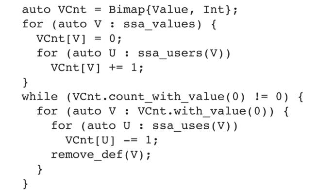
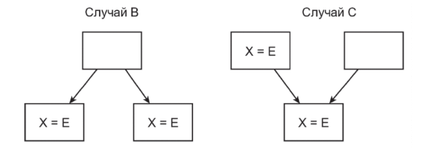
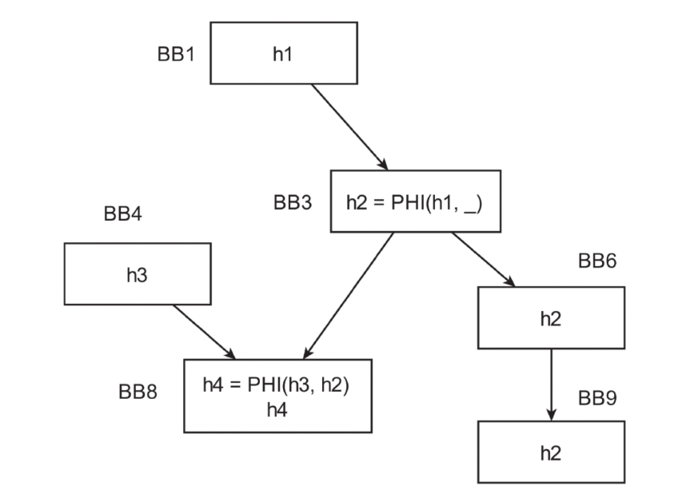

# Базовые оптимизации для SSA

Алгоритм

* Локальный - над одним бб
* Глобальный - над всеми бб ф-ции
* Межпроцедурный - между функциями/модулями

# Начало использования SSA

### Dead Code Elimination (DCE)

Удаляются i ssa-значения, которые не используются. Затем смотрятся значения j, которые использовал i, и если они после удаления i уже тоже неиспользоваются, то удаляются и они. И так до неподвижной точки.



## фреймворк ssa

x1 - ssa value

* users(x1) - множество ssa value, которые используют x1, в этом отношении x1 являтеся используемым.
* replace_uses_with(I, V, N) - заменить все вхождения V в инструкции I на N
* ssa_users - множество юзеров value
* ssa_uses - множество операндов

Каждая инструкция порождает ssa value: можно переходить от инструкции к ssa value. (Instruction is Value)

# Граф зависимостей SSA

SSA graph - это граф, вершины которого - определения SSA-переменных, а ориент. ребро ее использование.

# Spare Constant Propagation

```python

LVs = LatticeSet()   // решётка для всех вершин SSA
WL = Stack()         // рабочий список (стек)

procedure scp():
    initlattice() // анализ листов - если конст. то он константа, иначе он overdef. (top), все нелистья - undef.
  
    for each E in ssa_edges:
        if LVs[def(E)] != top:
            WL.push(E)
  
    while not WL.empty(): // продвигаем константы по ребрам
        E = WL.pop()
        D = def(E)
        U = use(E)
        M = meet(LVs[D], LVs[U]) // meet(top, bot) = top
  
        if M == LVs[U]:
            continue
  
        LVs[U] = M
  
        for each I in ssa_users(U): 
            WL.push(ssa_edge(U, I))
            OldVal = LVs[I.lhs()]
            NewVal = ssa_recompute_def(I.rhs(), U, M) // перерасчитать правую часть
            LVs[I.lhs()] = NewVal
            propagate(I, NewVal) // заменить все использования I на NewVal

procedure propagate(Instr I, Val NewVal):
  if (NewVal is numer):
    for (auto Val : ssa_users(I)):
      replace_uses_with(Val, I, NewVal)
```

Затем ненужные переменные удаляются DCE.

# Spare Conditional Constant Propagation (SCP + CFG)

```cpp
auto LVs = LatticeSet{};
auto SSAWL = Stack{};
auto CfgWL = Stack{entry_edges};
auto CfgF = Map<Edge, Int>{};

void sccp(Function F) {
  initlattice();
  for (auto E : all_edges(F)) CfgF[E] = 0;
  while (!SSAWL.empty() || !CfgWL.empty()) {
    if (!SSAWL.empty()) {
      auto E = SSAWL.pop();
      auto EOUT = {BB(def(E)), BB(use(E))};
      if (CfgF[EOUT] == 0) visitop(use(E));
    }
    else {
      auto E = CFGWL.pop();
      auto B = tip(E);
      CfgF[E] = 1;
      for (auto Op : all_instructions(B))
        visitop(Op);
      auto Es = out_edges(B);
      if (Es.size() == 1 && CfgF[Es.front()] == 0)
        CfgWL.push(Es.front());
    }
  }
}

```

```cpp
void visitop(Instruction Op) {
  if (Op is Phi) {
    auto OldVal = LVs[Op.lhs()];
    auto M = top;
    for (auto U : uses(Op))
      M = meet(M, LV[U]);
    if (M != OldVal) LVs[Op.lhs()] = M;
    propagate(Op, M);
  }
  else if (Op is Terminator) {
    for (auto [E, C] : outgoing(Op))
      if (satisfiable(C))
        CfgWL.push(E);
  }
  else {
    changed = update(Op);
    if (changed)
      for (auto U : users(Op))
        SSAWL.push({Op, U});
  }
}

```

## Другие propagation

Copy propagation, range propagation

## Global Value Numbering (GVN)

Начало: предположение - все операции возвращают одно и то же значение.

### Построение классов конгруэнтности

2 значения когруэнтны (одинаковы) если:

1. они принадлежат одному пакету
2. их агрументы попарно принадлежат одному пакету
3. если фи-узлы - то они принадлежат одному бб

Изначально все ssa значения бъются по пакетам:

* инструкции в пакеты с именем операнда
* неизвестные значения (вызов ф-ции и аргументы) в пакет со своим именем значения

Затем нужно бить пакеты, пока все инструкции в них не будут эквивалентны.

Если в одном пакете 2 значения эквивалентны и одно доминирует над другим, то другое избыточно, и может быть заменяно первым.

### Фреймворк GVN

бить пакеты пока можно

### Наивный алгоритм разбития пакета

Создать два пустых пакета, взять 1 инстр. и идти выбирать конгруэнтные инструкции и вставлять в один пакет. Остальные инструкции в другой.

### Граф конгруэнций

первый операнд - прямая стрелка

второй операнд - пунктирная стрелка

# Устранение частичной избыточности



Полная и частичная избыточности. (по всем путям или по некоторым)

### Критическое ребро

Ребро из блока с более одним потомком в бб с более одним потомком.

### Разбиение критического ребра

Вставка бб на критический блок. В результате нет критеческих ребер.

## SSA Partial redundancy elimination

* В первую очередь удаление синтакс.-определ. избыточности.
* Кандидаты на избыточность все вычисления, синтаксически выгл. одинаково

Приведенный граф избыточности (FRH, factored redundancy graph)



Он строится так:

1. вводится h
2. для нее строится SSA с фи-узлами

Вставлять вычисления можно только в те бб, в которых оказались фи-узлы (вставка только в фи узлы), по подходящим ребрам, но не во все ребра.

* небезопасный бб, если существует путь от данного бб до завершения программы, вдоль которого выраж. не вычисл. Алгоритм называется downsafe()
* не во все блоки нужно вставлять, где-то выражение уже доступно - willavail.

Итоговый алгоритм:

```cpp
split_critical_edges();
auto FRG = build_factored_redundancy_graph();
insert_phis(FRG);
downsafe(FRG);
willavail(FRG);
finalize(FRG);
```

* finalize 0
