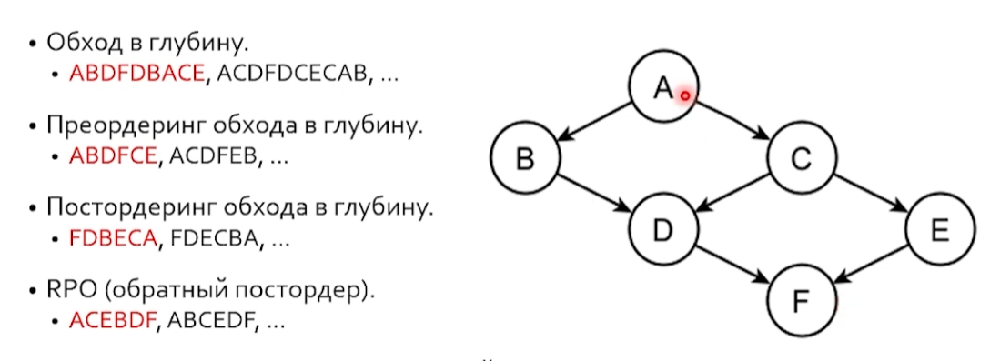
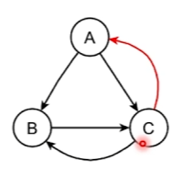
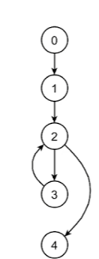
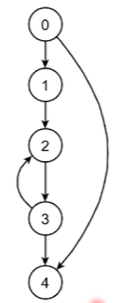
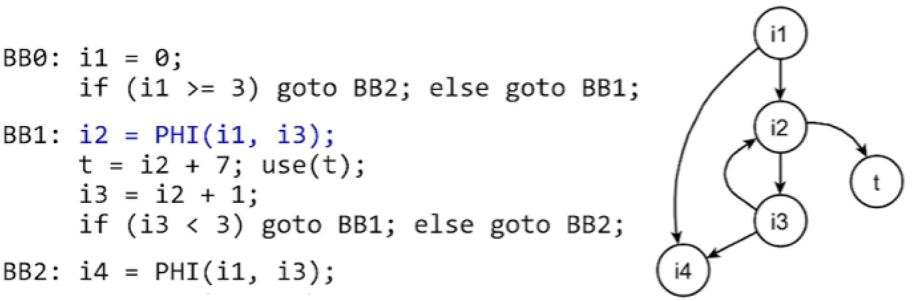
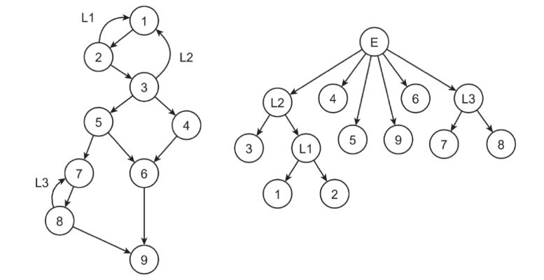
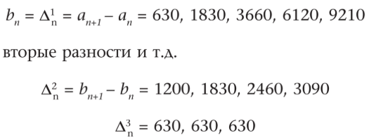
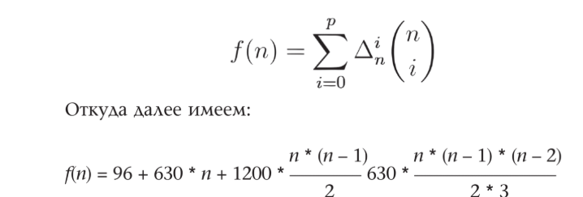
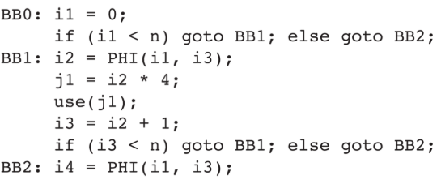
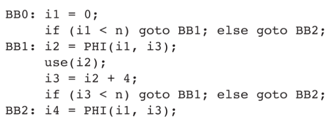

# Цикловые оптимизации

## Естественный цикл

*Обратная дуга* - дуга в которой ее конец доменирует ее начало (m -> n, n dom m)

*Естсественный цикл* :

* m->n обратная дуга
* состоит изо всех узлов, из которых достижима вершина m, если стереть n
* n доменирует надо всеми узлами

## Обходы и PRO

*Пост ордеринг* - записываем, тогда, когда уже не вернемся в этот узел



*PRO* - обратный постордеринг, интуитивно топологический порядок

## DPO

Построение dt графа, используя pro, сначала нумерация вершин по po, затем while change проходы по reverse po (топологический порядок). В самом вложенном цикле поиск общего доминатора у всех предицессоров при помощи восхождения по дереву доминаторов: immediate dominator

## Обращенные дуги и сводимость

* *PRO(V)* ф-ция, к-я возвращает номерв в каком-то PRO
* Обращенная дуга m -> n, такая дуга что PRO(m) >= PRO(n), для хотябы для одного PRO
* Если все обращенные дуги являются обратными, граф называется *сводимым*, иначе нет

  

Для этого графа PRO = {ACB}, {ABC};

### T1, T2

T1 Убирает цикл с обратной дугой на себя, заменяя его на базовый блок. T2 сливает в один блок два подряд идущи бб.

Если после конечного числа применения этих преобразований cfg сводится в однин бб, то он сводимый.

### Проблема

Над несводимым графом сложно проводить оптимизации

## Циклы

* Естественный цикл на дуге m -> n. n - *хедер*
* У цикла существует *прехедер* если в его хедер входят только две дуги m -> n, p -> n, где p - прехедер
* Прехед должен быть частью канонического цикла (нужен чтобы в него что-нибудь вынести)

### Предпочитаемая компилятором форма

```cpp
while (X > 5) {
  x = foo(x);
  y = bar(); // избыточность
}
```



```cpp
// A
y = bar();
while (x > 5) {
  x = foo(x);
}
```



```cpp
// B
if (x > 5) {
  y = bar();
  do {
    x = foo(x);
  } while (x > 5);
}
```

Компилятор предпочтет вариант B, т.к. избыт. не будет вычисл. если не зайдет в цикл. Но в варианте A она вычисл. в любом случае. Это *каноническая форма цикла*

### Определения

* (latch) *Защелка* естественного цикла в канонической форме на обратной дуге Bm -> Bn, является блок Bm, в который в канон. форме выносится вычисл. его условия
* (exiting) *Выходным блоком* цикла является блок, дуга которого ведет в блок не принадлежащий циклу
* (exit) *Пограничным блоком* для цикла является блок, в который ведет дуга из выходного блока

*loop rotate* - оптимизация llvm перевод. в конон. форму


## Loop closed SSA

(LCSSA) Все SSA-значения определенные в цикле используются либо в самом цике либо в пограничных блоках в качестве аргументов фи-узлов

### Отсюда и далее

* Цикл сводимый
* В канон. форме
* в LCSSA

## Индуктивная переменная

*Индуктивная переменная*  (обобщенная индуктивность, generalized induction variable, GIV)- это замкнутый путь в SSA графе, все вершины которого внутри цикла

Определяем индуктивную переменную, переменную в хедере



*Базовая индуктивность* (Basic induction variable, BIV) меняется в цикле один раз за итерацию цикла на константу (инвариант)

тут это i3 (= i2 + 1)

*Активная индуктивность* индуктивность в условии в защелке

Перйти к индуктивности - сделать ее активной

## Поиск BIV

*Дерево циклов* - дерево из циклов с вложенными циклами, и бб которые эти циклы занимают



Агоритм поиска траекторий biv

```cpp
auto biv_lookup(Loop L) {
    auto BIVs = Map<SSAVal, int>{};
    auto Increments = Map<SSAVal, int>{};

    IVCount = 0; 
    // IVCount — внутренний номер найденной индуктивной переменной.
    // Все SSA-значения одной цепочки Phi -> AddSub -> Cmp получают один номер.

    for (auto Phi : L.header().phis()) {

        auto Inc = 0;
        auto IVTmp = Map<SSAVal, int>{};

        for (auto AddSub : ssa_users(Phi)) {
            // AddSub — пользователь Phi, который проверяется как операция add/sub.
            // Например: i_next = i + 1 или i_next = i - 1.

            if (!L.contain(AddSub) || BIVs.contain(AddSub))
                continue;

            auto I = add_sub_increment_orzero(AddSub);
            // Возвращает шаг изменения: +1, -1, +4 и т.п.
            // Если AddSub не является подходящим add/sub, возвращает 0.

            if (I == 0)
                continue;
            // I == 0 означает, что нормальный ненулевой инкремент не найден.
            // Такой кандидат не подходит для basic induction variable.

            auto Cmp = ssa_single_user(AddSub);
            // Cmp — единственный пользователь результата AddSub.
            // Ожидается, что это будет инструкция сравнения.

            if (!Cmp || !check_compare(Cmp) ||
                ssa_single_user(Cmp) != Phi)
                continue;
            // 1) Cmp должен существовать.
            // 2) Cmp должен быть сравнением, а его единственный пользователь — тот же Phi.

            if (Inc != 0 && Inc != I) {
                Inc = 0;
                break;
            }

            Inc = I;

            IVTmp[Phi] = IVTmp[AddSub] = IVTmp[Cmp] = IVCount;
            // Phi, AddSub и Cmp относятся к одной индуктивной переменной.
            // Поэтому им присваивается один и тот же номер IVCount.
        }

        BIVs.insert(IVTmp.begin(), IVTmp.end());
        Increments[Phi] = Inc;

        IVCount++;
        // Переход к номеру следующей найденной индуктивной переменной.
    }

    return {BIVs, Increments};
}
```

### Отсюда и далее

* Цикл сводимый
* В канон. форме
* в LCSSA
* с условием выхода сравнивается biv (если нет, то нужен переход)

## Скалярная эволюция

*Скалярной эволюцией* (SCEV, scalar evolution) переменной называется зависимость ее значения от номера итерации

### Конечные разности





Затем это можно представить в виде цепочки рекуррентности <96, +, 630, +, 1200, +, 630>                        

Любая biv может быть записана как \<b0, +, i\> где b0 - начальное значение, i - шаг инкремента.

*Зависимой* индуктивной переменной (DIV, dependent induction variable) называется переменная, связанная с biv через скалярную эволюцию



Здесь j зависимая индуктивность. Можно оптимизировать, перейдя от i = \<0, +, 1\> к j = \<0, +, 4\>



(i3 < n * 4 в ветвлении)

В компиляторах такая оптимизация называется Induction Variable Optimizations (IV Optimizations)
