### Цикл

* естественный цикл
* if-do-while
* вынесенный прехедер
* сводимый cf
* LCSSA

# Оптимизация циклов

### Loop strengh reduction (LSR, Упрощение вычислений в циклах)

Трансформация перехода к новой индуктивности

Переход может зависить от конкретной платформы. Например переход от умножения к сдвигу.

### Loop unroll

Частичная раскрутка цикла

Частный случай перехода к новой индуктивности.

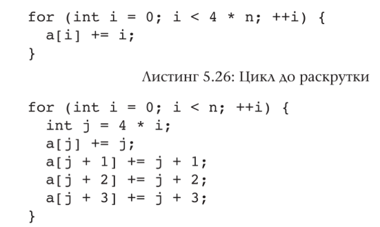

Это дает -к проверкам при обратной дуге и +к векторизации в случае поддержки со стороны железа.

Расскрутка с обработкой хвоста:

```cpp
if (n > 0) {
    int i = 0;

    for (; i + 3 < n; i += 4) {
        a[i]     += i;
        a[i + 1] += i + 1;
        a[i + 2] += i + 2;
        a[i + 3] += i + 3;
    }

    switch (n % 4) {
        case 3:
            a[n - 3] += n - 3;
        case 2:
            a[n - 2] += n - 2;
        case 1:
            a[n - 1] += n - 1;
    }
}
```

## Инварианты и квази-инварианты

Инвариант в цикле:

1. Выражение, не имеющее завис. от обобщенных индуктивностей цикла
2. Индуктивная переменная с тривиальной скалярной эволюцией. Пр. \<N, +, 0\>, \<M, *, 1\> и т.п.

### Вынос инвариантного кода из цикла (LICM, loop invariant code motion)

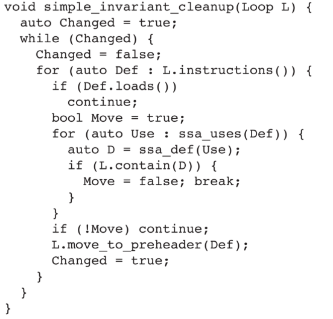

Вынос инструкций из цикла в прехедер, если они не используют результаты других инструкций, объявленных в цикле.

### Пилинг циклов (loop peeling)

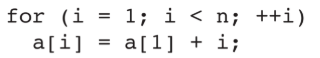


С учетом перезаписи на первой итерации можено представить, как:

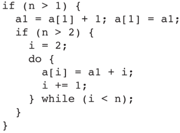

Пилинг циклов - вынос итераций и их разворачивание

### Определение квази-инварианта

*Квази-инвариант* - перемен. станов. инв. если убарть цикла определенные итерации.

*Истиной зависимостью по данным* между SSA пермен. x и y: x в определен. y, и x dom y.

*Анти зависимостью* x в опред. y и y dom x

*Variable dependecy graph, VDG* - граф с вершинами SSA значения и ребра - типы зависимости.

* Если по всем по всем путям конч. в верш. нет путей с вершинами из связаных компонентов, то это квази-инвариант

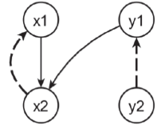

Тут y1 - квази-инвариант, но не x1.

## Структурные оптимизации

### unswitching

Вынос инвариантного управления (ветвления) из цикла.

### loop spliting

Разрезать иттерационное пространство

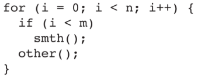

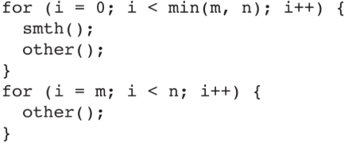

### Lopp fusion/destribution

Разрезать по телу цикла

Сведение/разбиения тела цикла.

В случай destribution нужно для улучшения работы кеша в работе с массивами

### unroll and jam

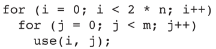


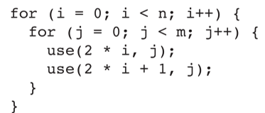

При unroll дублирование внутр. цикла, затем jam.

## Оптимизации для локальности данных (кеш)

### loop interchange

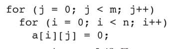

Поменять местами циклы

### loop tiling/flattenig

Усложнение/упращение доступа/работы над массивом в цикле

Итого:

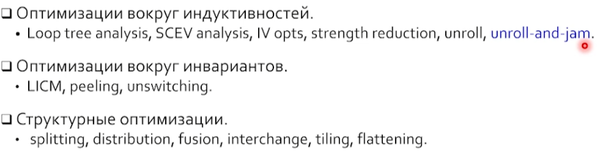
