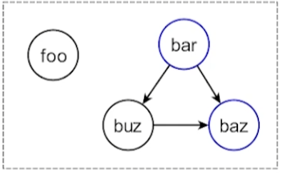

# Работа с функциями

### Call grap

Граф вызовов фунцкий, где вершины - ф-ции, дуги - вызовы

Могут быть 2 типа дуг - индеректные и деректные вызовы.

### DFEN (N - naive)

Удаление функций, которые не используются, и которые не входят в интерфейс модуля.

Алгоритм как в DCE



Синим - static. Можно удалить bar. Но не foo.

Не удалит, если static вызывают друг дргуа.

## Продвижение информации

1. клонирование функции
2. ```cpp
   void propagate_arg(Function F, int ArgNo, auto Val) {
       auto Def = F.get(ArgNo);
       if (!static(F))
           return;
       for (auto U : ssa_users(Def))
           replace_uses_with(U, Def, Val);
       if (F.cguses.empty())
           F.remove_arg(ArgNo);
       sccp(F);
   }

   ```
