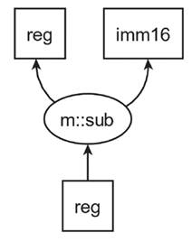
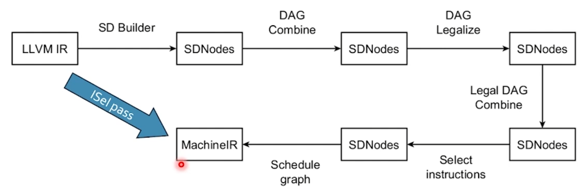

# Разрушение SSA

### LIR

Low level ir - ir с ssa, но с инструкциями

В книге

* Одно вычисление - одно машинно-зависимая операция.
* Усл. или бесусл. переходы
* Все операции над вирт. Vi или физ Ri регистрами (тут 64 бита)
* Физ регистры: несколько классов с буквой обозн. класс, сквозная нумерация в общем
* Физ регистры - аргументные Ai
* Разделение - точка с запятой

*Графом выбора инструкций (Selection DAG)* - вершины инструкции LIR, ребра связь по данным

## Переход в SDHIR

*SDHIR* - это HIR на Selection DAG, в DF которого нет обратных и обращенных дуг.

## Легализация

Приведение типов операций к легальному виду.

## Выбор инструкций

Смысл выбора это переход от Selection DAG к соот. машин. инструкциям кокретной машины. Каждая машин. инстр. представленна подграфом, который называется DAG fragment или паттерном. 

*Матчем* называется отображение паттерна на подграф.

*Полное покрытие* - набор матчей на Selection DAT, таких что каждая вершина и дуга покрыта один раз.

## Конвеер instr selection

