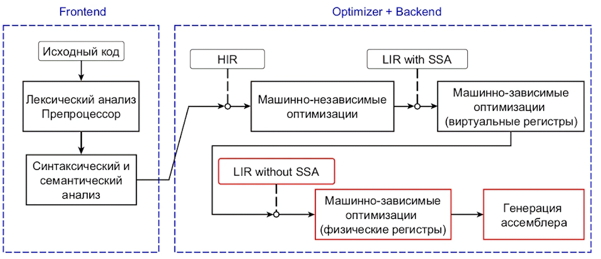
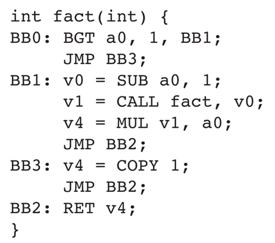

### Пайплайн компиляции в современных компиляторах

## Разрушение SSA

Для только простроенного SSA (просто убрать фи-узлы):

* определить семантическую сеть переменной (вокруг фи-узла) через union-find
* назначить для всех входящих в эту сеть перменных один регистр

Для обработанного SSA дополнительно:

* вставить копии
* расплитить критические ребра

  

# Распределение регистров (reg alloc)

## Подход на раскраске графов

*Интервал активности (live interval)* - совокуп. мест, где вирт. рег. использован, от его опред. до его последнего места исп.

*Граф несовместимостей (inference graph)* - вершины - вирт. регистры, ребра - если пара рег. активны одновременно.

Получается при помощи анализа live variable.

Далее IG красится физическими регистрами.

*Spill* - процесс временной материализации вирт. рег. (сохранение в память). Обратный процесс - fill.

Рематериализация - вычисления значения заново

## Подход Полетто

Линейно проходиться по live intervals.
