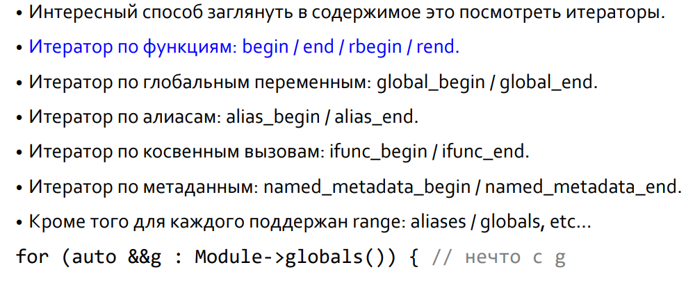

# Кодогенерация

## Контекст

* Содержит все глобальные сущности, например типы.
* Примитивные типы можно просто получить `llvm::Type::getInt32Ty(*currentContext);`
* Более сложеные типы конструируются из примитивных:
  ```cpp
  Type* Tys[] = { getInt32Ty(*currentContext) };
  FunctionType* FTPrint = 
    FunctionType::get(getVoidTy(*currentContext), Tys, false);
  ```

## Модули

* Модуль создается при помощи контекста
  `Module = std::make_unique<llvm::Module>("pcl.module", Context);`
* Он обозначает единицу трасляции.
* Можно выставить DataLayout и TargetTriple
  `Module->setTargetTriple("x86_64-unknown-unknown");`
* Модуль - это мультиконтейнер
* 

## Функции

* Функция создается после того как создан ее тип

  ```cpp
  auto* Int32Ty = llvm::Type::getInt32Ty(Context);
  auto* ScanTy = llvm::FunctionType::get(Int32Ty, false);
  // создание функции
  auto* ScanF = Function::Create(ScatTy, ExternalLinkage, "__pcl_scan");
  ```
* Затем функцию можно добавить в модуль, учитывая что функции это интрузивный список

  `Module->getFunctionList().push_back(Scanf);`

## Базовые блоки

* Чтобы начать вставку нужен базовый блок.
  `auot* BB = BasicBlock::Create(*Ctx, "entry", CurrentFunction);`
* Имя и функция – не обязательные параметры.
* Ещё один параметр, четвертый это блок после которого вставлять (по умолчанию в конец).
* Функция является родителем блока, но блок всегда может быть отвязан от функции через removeFromParent и вставлен в другую через insertInto.
* Кроме того у блока есть eraseFromParent которая отвязывает его от родителя и стирает

## Bilder

* `auto Builder = std::make_unique<llvm::IRBuilder<>>(Ctx);`
* Класс llvm::IRBuilder имеет два шаблонных параметра, здесь оба по умолчанию.
* InserterTy это ваш собственный класс, который должен быть наследником класса IRBuilderDefaultInserter.
* FolderTy это ваш собственный класс, который должен быть наследником класса IRBuilderFolder по умолчанию это ConstantFolder.
