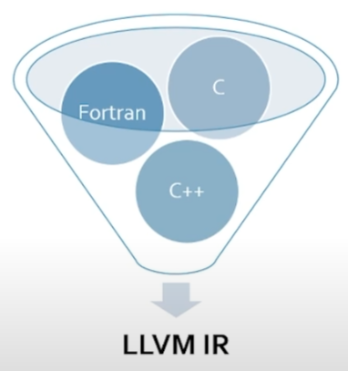
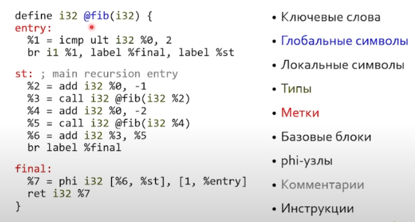
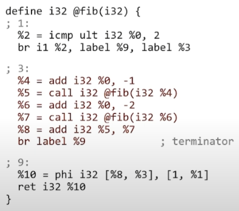
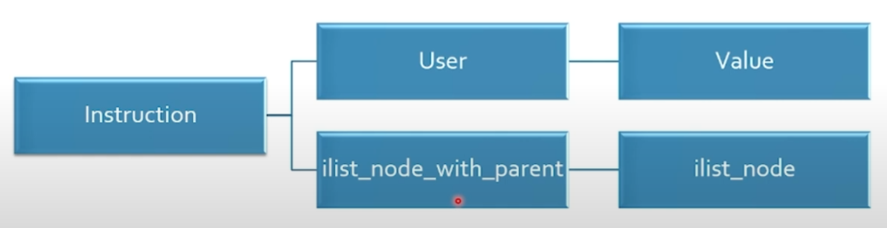

# LLVM - разработка и предназначение



* Лицензионная дружественность
* Модульность
* Текстовая читаемость
* Сильная типизация
* IR это виртуальный набор инструкций, подходящий для всех языков
* Более низкие уровни lR играют ту же роль для архитектур

## Основные термины LLVM IR



### Базовый блок

Линейный участок кода, который имеет один вход и сколько угодно выходов.

Базовый блок заканчивается терминатором.



(Сущности без имени автоматически получат название)

### Локальные символы

Это *SSA (Static Single Assignment)* value - (%name). SSA value имеет одно объявление и определение в рамках одной функции.

### phi-узлы

Это схождение управление.

Обычно представление:

```c
x = foo();
if (x > 5) x = x + 1;
x = x + 2;
```

SSA представление:

```c
x.0 = foo();
if (x.0 > 5) x.1 = x.0 + 1;
x.2 = phi(x.0, x.1) + 2;
```

### Инструкции

* Базовый LLVM lR содержит фиксированное количество платформенно-независимых инструкций.
  `<res> = add <ty> <op1>, <op2>`- один тип операндов.
  `br i1 <cond>, label <iftrue>, label <iffalse>`
  `br label <dest>`

### Типы

* Пустой тип: void
* Скалярные типы: i1, i8, i16, ..., half, float, double
* Векторные типы: <10 x i32>
* Указатели: i32, i32 addrspace(5)*
* Массивы: [10 x i32], [12 x [10 x float]]
* Структуры: {i32, i32, float, i8}
* Функции: i32 (i32, i32)

## load & store

* Все операции с памятью продят по указателю.
* Чтобы загрузить значение, мы указывам его слева.

  `%1 = load i32, i32* %idx2`
* Чтобы сохранить значение, мы указываем его справа.

  `store i32 %1, i32* %idx2`

### Глобальные переменные

* Глобальная переменная это всегда указатель

  `@gv = global i8 0; i8* const`

  `@gvc = constant i8 42; const i8* cosnt`
* Это означает, что она может использоваться в load/store напрямую
  `%1 = load %i32, i32* @gvc`

  `store i32 %1, i32* @gv`

`@fibarr = global [10 x i32] zeroinitializer`

## Gep: униформность доступа

* gep - возможность доступа к агрегатным структурам данных (массивы, структуры, но не вектора).
* Идея - одинаковый доступ к массивам и структурам.
* Здесь каждый индекс снимает один уровень косвенности
  `<result> = getelementptr <ty>, <ty>* <ptrval> {, <ty> <idx>}(1 или больше)`
  *хотим написать: fibarr[1] = 1*
  `%fst = i32* getelementptr [10 x i32], [10 x i32]* @fibarr, i64 0, i64 1; OK`
  `store i32 1, i32* %fst`
  

### GEP для структуры

```python
; struct S { int x, double y, float z[10] };
%struct.S = type { i32, double, [10 x float] } ; имя типа
@x = %struct.S zeroinitializer

define i32 @main() {
    %eltptr = getelementptr %struct.S, %struct.s* @x, i32 0, i32 2, i64 3
}
```

# IR в с++



## Идеология User/Value

Инструкция, которая порождает Value это и есть Value (по SSA)`

```python
%1 = add i64 %0, 1  ; value
%2 = add i64 %1, %1 ; user / value
%3 = add i64 %1, %2 ; user
```

* Value знает обо всех своих User (Value::use_iterator)
* User знает о других своих операндах (User::op_iterator)
  `User::getOperand(i)` вернет Value*

## Ilist: интрузивные списки

* Интрузивный - каждый элемент сам предоставляет ссылку на родителя/предка.
* Instruction - наследуется от ilist_node
* Т.е. можно сделать так `Instruction* subInst = addInst->getNextNode();`

## Функции

* объявление `declare i8* @malloc(i32); ~ c std lib malloc`
* индиректные вызовы `%result = call i64 %op(i64 %x)`
