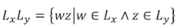
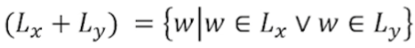
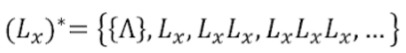

# Языки

## Алвавит и строки

* *Алфавит* это множество символов, например {a, b, c}
* *Строкой* называется последовательность символов, например w = {a, a, c, b} (w = aacb)
* *Конкатенация* строк: w = aacb, z = ba, wz = aacbba, zw = baaacb
* *Степень* строки: w\*\*3 = www, w\*\*0 = ^

## Формальные языки

* *Языком* над данным алфавитом называется множество его строк
  * Язык Lemtpy = пустое множетво строк
  * Язык Lfree = все возможные строки алфавита (группа по конкатенации)

### Примеры:

* Язык L1 = {a^m, b^n}: a, ab, aab, aabb, abb...
* Язык L2 = {a, cab, caabc} *(конечный язык)*
* Язык L5 = {a^mb^n*c*a^mb^n}: aca, abcab

## Задачи для формальных языков

* Принадлежность: определить, принадлжить, ли строчка языку.
* Порождение: последовательно порождать все строки языка.
* Эквивалентность: имея два языка, определить, принадлежат ли им одинаковые элементы.
* Отрицание: имея язык, описать другой язык, тако что в нем будут строки не принадлежащие изначальному.

## Регулярные выражения

Формальный способ описать язык.

* Любой алфавитный символ означает язык из этого символа: a это {a}
* Конкатенация: 
* Дизъюнкция: 
* Замыкание 
* Языку (c(a + b)*ab)*ca принадлежит {ca}, но не принадлежит {caabbca} (2 b подряд).
* a? = a + ^ (ноль или одно повторение)
* a+ = aa* (одно или больше повторений)
