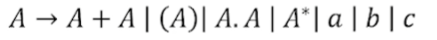
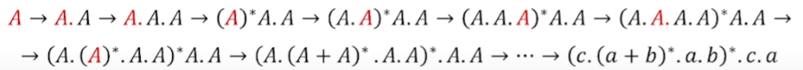
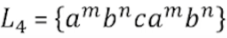
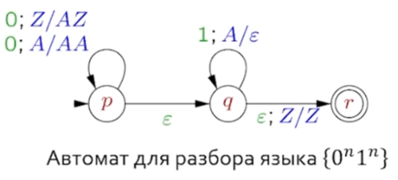
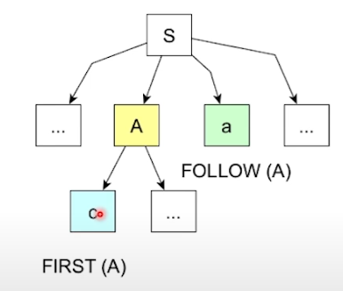

# Языки

## Алвавит и строки

* *Алфавит* это множество символов, например {a, b, c}
* *Строкой* называется последовательность символов, например w = {a, a, c, b} (w = aacb)
* *Конкатенация* строк: w = aacb, z = ba, wz = aacbba, zw = baaacb
* *Степень* строки: w\*\*3 = www, w\*\*0 = ^

## Формальные языки

* *Языком* над данным алфавитом называется множество его строк
  * Язык Lemtpy = пустое множетво строк
  * Язык Lfree = все возможные строки алфавита (группа по конкатенации)

### Примеры:

* Язык L1 = {a^m, b^n}: a, ab, aab, aabb, abb...
* Язык L2 = {a, cab, caabc} *(конечный язык)*
* Язык L5 = {a^mb^n*c*a^mb^n}: aca, abcab

## Задачи для формальных языков

* Принадлежность: определить, принадлжить, ли строчка языку.
* Порождение: последовательно порождать все строки языка.
* Эквивалентность: имея два языка, определить, принадлежат ли им одинаковые элементы.
* Отрицание: имея язык, описать другой язык, тако что в нем будут строки не принадлежащие изначальному.

## Регулярные выражения

Формальный способ описать язык.

* Любой алфавитный символ означает язык из этого символа: a это {a}
* Конкатенация: 
* Дизъюнкция: 
* Замыкание 
* Языку (c(a + b)*ab)*ca принадлежит {ca}, но не принадлежит {caabbca} (2 b подряд).
* a? = a + ^ (ноль или одно повторение)
* a+ = aa* (одно или больше повторений)

## Лемма о накачке

Лемма о накачке гласит, что для любого достаточно длинного слова w в регулярном языке найдется такая декопозиция w = xyz, что все слова xy^nz также принадлежат этому языку.

## Грамматика

* Терминальные символы - настоящие символы
* Не терминал - воображаемый символ, семечко.  (пример над {a, b, c])

Строительство (c.(a+b)*.a.b)*.c.a (последотельность получений продукций)

Получен вывод, использующий на каждом шаге продукцию.

### Контекстная свобода и зависимость

Контекстно свободной грамматикой называется такая грамматика, которую можно представить так, чтобы слева в каждой продукции быр ровно один нетерминал. "if везде if"

Язык  не является контекстно свободным (похоже на объявление и вызов функции).

Свойства, которые в К.С. граматиках не проверяются, называются семантическими.

Сам язык принято описывать контекстно свободной граматикой.

## Автомат с магазинной памятью

* Pushdown automata - НКА со стеком.
* Переход делается по входному символу и по стековому символу.
* При переходе можно запушить или извлечь символ.
* Z/AZ означает "если верхушка Z то перейти и запушить A"

## Таксономия L/R

* Первая буква означает направление
  * L означает слева направо
  * R означает справа налево
* Вторая буква означает выбранный нетерминал
  * L означает берем самый левый
  * R означает берем самый правый
* Далее могут следовать скобки в которых стоит сколько символов предпросматриваем.
* Есть также префиксы например LALR (LA  = look ahead)
* Мы можем формулировать вопросы про языки в терминах их классов

## Ограничение на LL(1)

* Можно доказать, что язык относится к LL(1) если и только если для двух разных продукций A -> alf и       A -> bet
* Не существует терминала alf, такого, чтобы alf и bet выводили строки начинающиеся с alf.
* Не более чем одна из alf и bet выводит пустую строку.
* Если bet выводит пустую строку, то alf не выводит строк из FOLOW(A).

  
